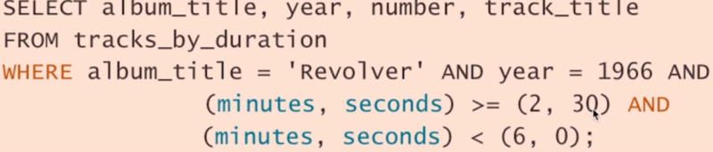
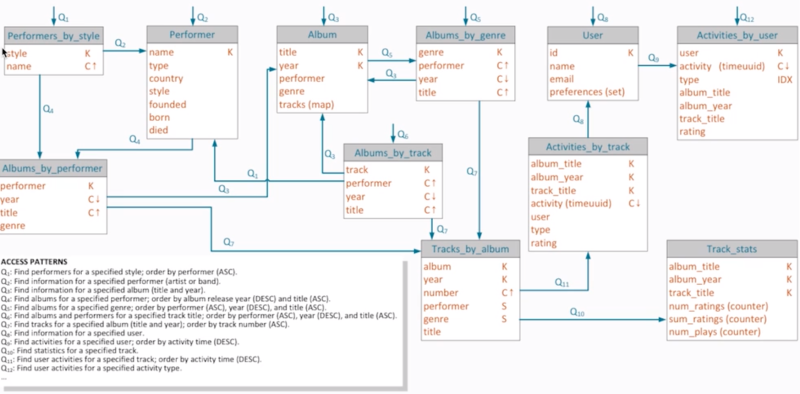
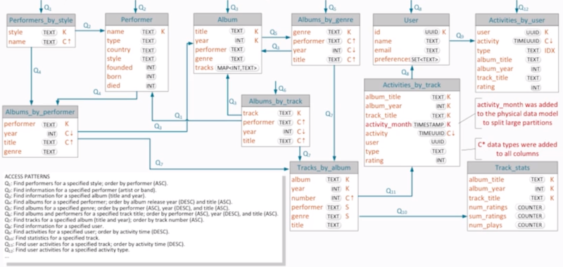

# CQL
---

**What is it?**

- tabular presentation of results
- selecting returns result set in order defined by clustering primary key
- every writes get a timestamp; the data with the latest timestamp gets served; – how scaling out w/ more nodes work
- terminologies
	- table = Thrift:column family; they’re called column family because partitions are just key-value and not a table
	- table is a set of partitions and a partition may be single or multiple row = Thrift:row (skinny or wide)
		- skinny: simple partition
		- wide: partition with multiple hits
	- partition key uniquely identifies a partition and may be simple or composite = Thrift:row key
	- column uniquely identifies a cell in a partition, and may be regular or clustering = Thrift:column key
	- primary key is comprised of a partition key and clustering columns if any; and uniquely identifies a row in both partition and table
	- composite keys
		- composite partition key: PRIMARY((title, year))
		- one partition key with composite clustering column declarations: PRIMARY(tack_title, performer, year, album_title)
		- composite partition key with composite clustering columns
	- keyspace: top level namespace where you set replication

**Limitations**

- size of column family is only limited to the size of the cluster
- data from one row must fit on one node
- maximum columns per row is 2 billion
	- in practice – up to 100,000
- maximum data size per cell (column value) is 2GB
	- in practice – 100MB
- if you want to change your primary key, you have to create a new table. you cannot modify primary key.
- can only reverse the specified order by traversing the rows within a partition

**Shell command:**

- .cqlsh
	- select * from performer limit 3; – shows rows
- ccm node1 cli
	- list performer limit 3 – shows partitions with values in hexadecimals

**column types:**

- can declare static: only one row would exist for the static column; cannot be part of primary key
- counter
	- performance (a read is required before update) and accuracy considerations (counter update is not an idempotent operation)
	- could become problem during retries so client cannot retry when counter update times out
- set: guarantees uniqueness; ordered by value
- list: maintains sequence and appends; map: key-value
- user-defined types
	- “CREATE TYPE track(album_title TEXT, album_year INT, track_title TEXT);
	- alter and drop available
- tuple: holds fixed length sets of typed positional fields
	- convenient alternative to user defined types
	- up to 32768 fields but generally only use a few
	- useful when prototyping
	- must use “frozen” keyword in C*2.1
	- tuples can be nested in other tuples
	- CREATE TABLE user (
…
 equilizer frozen<tuple<float, int, float>>,
- frozen: indicates that values must be written in its entirety for user-defined and tuple types

criteria

- where
- order by
- limit

secondary indexes

- searching only on secondary index requires basically searching all nodes (scatter gather operation)
- when do you want it?
	- searching convenience
	- use with low-cardinality columns – columns that may contain relatively small number of distinct values – result set will have more manageable size
	- don’t use:
		- on high cardinality columns
		- on counter column tables
		- on a frequently updated or deleted columns
		- to look for a row in a large partition unless narrowly queried – e.g. search on both partition key and indexed column

**TIMEUUID**

- generated using time (60bits), a clock sequence number (14bits), and MAC address (48bits)
- now() generates TIMEUUID
- dateOf() extracts the embedded time
- can be ordered by time using TIMEUUID

**Inserts**

- requires PK
- atomic – all values of a row are inserted or none
- isolated – two inserts with same values in pk columns don't interfere – just gets executed one after another
- light-weight transactions via “IF NOT EXISTS” to replace the behavior of overwriting – Paxos consensus algorithm that requires multiple roundtrips
- TTL available (INSERT INTO blah (foo) VALUES (bar) USING TTL 86400)
- collection
	- set: insert into band (name, members) values (‘the beatles’, {‘paul’, ‘john’, ‘george’}); – no dupes
	- list: insert into song (id, title, songwriters) values (‘123’, ‘Let it be’, [‘John’, ‘Paul’]); – dupes and ordered
- tuple: insert into user (id, equalizer) values (1, (3, 6, 7, 3.9));

**Updates**

- requires full PK to identify column
- PK cannot be updated
- a new value is added if not exist (upsert)
- atomic
- isolated
- use “IF” to verify the value for columns before execution
- TTL available (UPDATE blah USING TTL 30…)
- collection
	- set: update band set members = member + {‘pete’} where name = ’the beatles’;
	- set: update band set members = member – {‘pete’} where name = ’the beatles’;
	- list: update song set songwriters = songwriters + [‘Paul’] where…; // append
	- list: update song set songwriters = [‘Paul’] + songwriters where…; // prepend
	- list: update song set songwriters[3] = ‘Ringo’ where…;
	- list: update song set songwriters – [‘Patrick’] where…;
- udf: use json – insert into table1 (udf1) values ({blah: ‘foo’, ice: ‘cream’}); // upsert works too

**Deletes**

- you can delete a single column (or cell) with DELETE column_name FROM …
- if  you insert a null… that is same as deleting
- “TRUNCATE table_name – deletes all records in a table – if the default setting of auto snapshot is on, snapshot gets created before the truncate so you can easily recover
- set
- list: delete songwriters[0], songwriters[1] from song where id = blah

**Batch**

- combines multiple inserts, update, delete statements into a single logical operation
- atomic operation – all it does is all statements end up with same exact time stamp and makes sure that the whole group will be completed; atomic including the lightweight transaction result
- no batch isolation – other transactions can read and write data being affected by a partially executed batch
- no rollback
- statements not ran in order; also they’ll all get a same timestamp so you cannot put statement that relies on each other within a batch
- BEGIN BATCH … APPLY BATCH;
- essentially supports ACID but not like RDBMS

**Select**
- count(*)
- IN is only allowed on the last clustering column of a primary key or partition key
- to retrieve one partition, values for all partition key columns must be specified
- to retrieve a subset of rows in a partition, values for all partition key columns and one or more but not all clustering columns must be specified
- range search
	- < <= >= > is allowed on only one clustering column in a predicate, not on partition key
	- slice of a partition – PRIMARY KEY (track_title, minutes, seconds);

- ALLOW FILTERING
	- allows certain kinds of full table scan – on clustering column but not on regular fields
	- must have preceding column to make it work – CLUSTERING ORDER BY(performer, year, title) – must have performer to search on year and performer and year to search title
	- LIMIT clause recommended
- secondary index
	- only applies to equality matches but not on range
	- set list map – search for value
		- create index on user(preferences)
		- select id from user where preferences CONTAINS ‘Rock’;
	- map – search for key
		- select title from album where tracks CONTAINS KEY 20;
		- can’t create index on both value and key
	- UDF and tuples
		- column is treated as blob and and must search on all fields
		- select * from track where song = {title: ‘beatles’, year: 1964’};
		- select * from user where equalizer = (1.0, 2.0, 3.0);

**Functions**

- dateOf()
- now()
- minTimeuuid(), maxTimeuuid(): The min/maxTimeuuid example selects all rows where the timeuuid column, t, is strictly later than 2013-01-01 00:05+0000 but strictly earlier than 2013-02-02 10:00+0000. The t >= maxTimeuuid(‘2013-01-01 00:05+0000’) does not select a timeuuid generated exactly at 2013-01-01 00:05+0000 and is essentially equivalent to t > maxTimeuuid(‘2013-01-01 00:05+0000’).
- unixTimestampOf() – more precision than dateOf()
- typeAsBlob(), blobAsType() – conversion
- token() – token access // only using for traversing entire token range on every node

Data modeling – query centric design

- Conceptual data model – same thing as what you always've done
	- technology independent unified view of data
	- entity-relationship model (ER diagram), dimensional model, etc
- Logical data model
	- Unique for Cassandra
	- Data is viewed and organized into column families/tables
	- Column family diagrams / Chebotko diagram
		- K: partition key
		- C: clustering column
		- S: static column
		- IDX: index column

- Physical data model
	- Unique for Cassandra
	- CQL definitions
	- considerations:
		- natural or surrogate keys? – prefer natural
		- are write conflicts (overwrite) possible?
		- data type?
		- how large are partitions?
		- how much data duplication is required?
		- are client side joins required and at what cost?
		- are data consistency anomalies possible?
		- how to enable transactions and data aggregation?

- Framework
	- defines transition between models
		- query driven methodology between conceptual and logical
		- formal analysis and validation between logical and physical
	- approach
		- modeling rules
		- mapping patterns
		- schema optimization

**Source**

- executes a file containing SQL statements
- SOURCE ‘./myscript.cql’;

---
