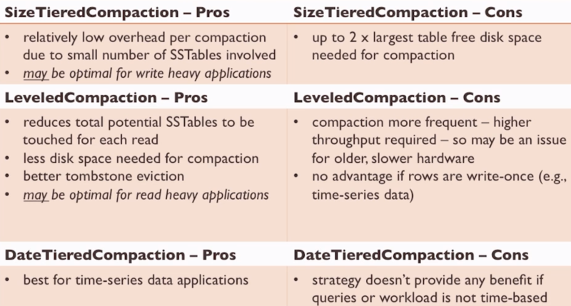

# Compaction
---
Delete in Cassandra is a write of a delete marker (tombstone)

1. a tombstone is applied to the table in Memtable
2. subsequent queries treat this column as deleted
3. at the next Memtable flush, the tombstone passes to the new SSTable
4. at each compaction, tombstone columns older than gc_grace_seconds (10 days by default) are evicted from the newly compacted SSTAble
	5. gc_grace_seconds is 10 days for those nodes that are off at the time
	6. zombie columns happen that restores deleted column after gc_grace_seconds – the cure is ‘nodetool repair’

Efficient because:

- SSTables are sorted by partition key
- no random IO required

Necessary because:

- SSTables are immutable, so updates fragments data over time
- deletes are writes and must be cleared periodically

Impacts

- during compaction
	- disk IO
	- off-cache read performance
- after
	- read perf increase as less SSTables are read for off-cache reads
	- disk utilization drops

Strategies

- size-tiered (default) – compaction triggers as number SSTables reach a threshold
	- compacts set number of similarly sized SSTables to a large SSTable
	- fast to complete each compaction b/c relatively few SSTables are compacted at once
	- inconsistent read latency
	- requires significant disk space (2x free disk space as largest CQL table)
	- preferable for write-heavy and time-series data apps
	- full compaction (compacts all or specified SSTables into one) is not recommended for production use
		- uses considerable disk IO and disk space
		- if the SSTable gets big, it would take a lot for other SSTables to reach the same size so the compaction on that SSTable gets latency
- leveled – uniform size SSTables organized and compacted by successive levels
	- uses less disk (10%) and the read latency is more consistent and predictable than size-tiered – but uses double the disk IO during writes (should use SSD)
- date-tiered – data written within a certain time window is saved together
	- ideally suited for time-series data
- ALTER TALBE… WITH compaction = {‘class’: ‘SizeTieredCompactionStrategy’};

---
