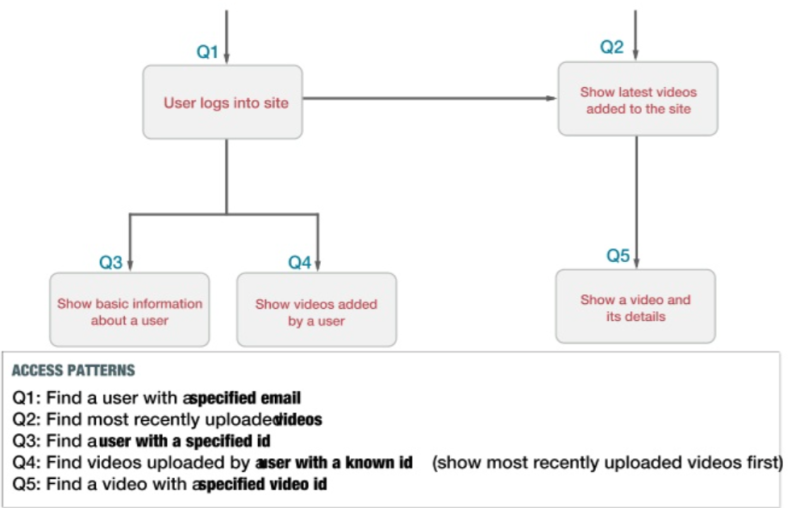
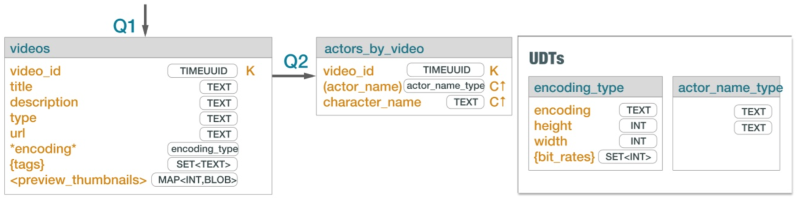

## DATA MODELING

### 1. Conceptual Data Model
Entity type hierarchy
- Entity, relationships, attributes, keys, cardinality constraints
- Transitivity – multi-level subtype in IsA relationship
- Inheritance – attribute inheritance in IsA relationship
- Disjointness constraint – IsA relationship that you specify when relationship is disjoint
 - video is a full video
 - video is a trailer
 - video cannot be both
- Covering constraint – a union of all entities that belong to an entity type equals to the set of entities of main type
 - Using the disjointness constraint example
   - Full video + Trailer covers all of the possible roles for a video
   - Not covering means other video types like TV show and movies exist

### 2. Application Workflow Model
- tasks and casual dependencies form a graph
- access patterns determine how data is accessed – know what queries you will run

### 3. Mapping Conceptual to Logical
Process to design logical model
- use top down approach
- can be algorithmically defined
- effective in a long run

Query driven data modeling
- Uses conceptual data model, application workflow, and access patterns as inputs to generate logical data model
- Described using the Chebotko diagram notation
  - visual diagram for tables and access patterns = schema
  - documents the logical and physical data model

Logical diagram

Physical diagram

Data modeling principles
- know your data
- know your queries
  - partition per query – ideal
  - partition+ per query – acceptable
    - ex. find movies that match one of multiple genres
  - table scan – anti-pattern
  - multi-table – anti-pattern
    - ex. retrieve all data in a database

- nest data – denormalization
  - organizes multiple entities into a single partition
  - supports partition per query access
  - mechanisms
    - clustering columns
    - collection columns
    - user-defined type columns
  - duplicate data – denormalization
    - better than join
    - join on write

Mapping rules for the query driven methodology
- ensure that logical data model is correct
- each query has a corresponding table
- tables are designed to allow query to execute properly
- table returns data in correct order
- Mapping Rule 1: entities and relationships
  - entity and relationship types map to tables
  - entity and relationships map to partition or rows
  - partition may have data about one or more entities and relationships
  - attributes are represented by columns
- Mapping Rule 2: equality search attributes
- Mapping Rule 3: inequality search attributes
- Mapping Rule 4: ordering attributes
- Mapping Rule 5: key attributes
