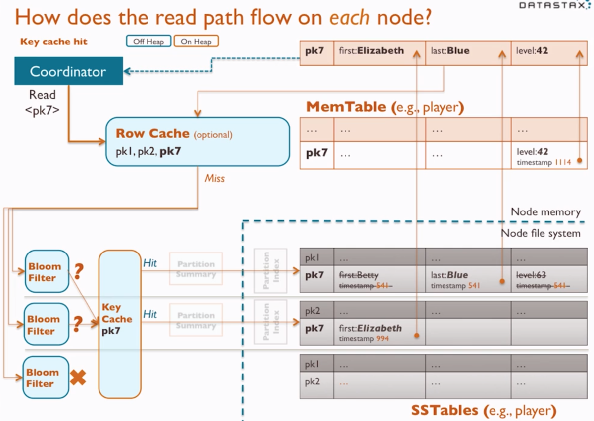

# Read path
---

**Structure**
- in-memory
	- MemTable: serves data as part of the merge process
	- Row Cache: stores recently read rows (optional)
		- enabled in CQL – CREATE TABLE… ‘WITH CACHING = {‘keys’: ‘ALL’, ‘rows_per_partition’: ‘1’}
			- ALL
			- n – cache the first n rows for a partition key
			- NONE – default
		- row_cache_size_in_mb – max row cache size, set to 0 to disable (0 by default)
	- Bloom Filters: reports if a partition key may be in its corresponding SSTable (check if it’s not there)
		- each SSTable has a Bloom Filter on disk; used from off-heap memory
		- false positives are possible, false negatives are not
		- larger tables have higher possibility of false positives
		- can trade off memory to get better accuracy via config setting: bloom_filter_p_chance
			- 0.0: no false positive; greatest memory use
			- 0.1: max recommended setting, diminishes returns when it’s higher
			- 1.0: bloom filter disabled
			- default setting depends on compaction strategy
				- 0.0.1: sized tiered compaction (STC)
				- 0.1: leveled compaction (LCS)
	- Key Caches: maps recently read partition keys to specific SSTable offsets
		- enabled in CQL – CREATE TALBE… ‘WITH CACHING = {‘keys’: ‘ALL’, ‘rows_per_partition’: ‘1’}
			- ALL – default
			- NONE
		- key_cache_size_in_mb
		- counter_cache_size_in_mb: counter cache is similar to key cache
	- Partition Summaries: sampling from partition index
		- used to locate a key’s approximate location on the full index
		- default sample ratio is 1 per 128 partition keys in the index
		- CREATE TABLE… WITH min_index_interval (default 128)
		- CREATE TABLE… WITH max_index_interval (default 2048)
		- held in off-heap memory but in-memory
- disk
	- Partition Indexes: sorted partition keys mapped to their SSTable offsets
	- SSTables: static files periodically flushed from Memtable

**Read path flow**
- Best case scenario: hit row cache – row cache is optional b/c typically row cache is duplicate of OS file system cache (both goes to RAM)
- Second best case scenario: hit key cache
- Worst case scenario: don’t hit key cache and goes through partition summary and partition index

